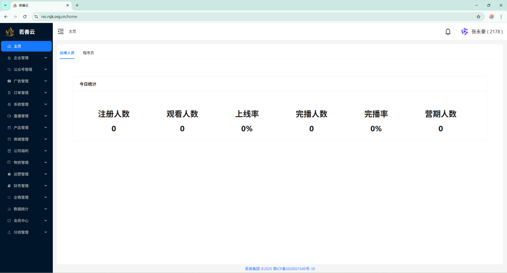

# 网站日志说明文档

### 关于本网站

欢迎访问**若善云系统平台官方教程网站**！

本网站是专为[若善云系统平台](https://rsc.rsjk.org.cn/)  用户打造的教学教程指导平台，提供全面的系统使用指南、操作教程和最佳实践。

<!-- truncate -->
<!-- {/* truncate */} mdx的分隔 -->
### 若善云系统平台简介

若善云系统平台是一个集企业管理、直播管理与营销销售分析于一体的综合性云平台，致力于为企业提供高效、安全、便捷的云端工作体验。

### 平台界面展示

*若善云系统平台主界面*

---

**备注：** 本日志文件将持续更新，记录系统开发进展和教程更新情况。