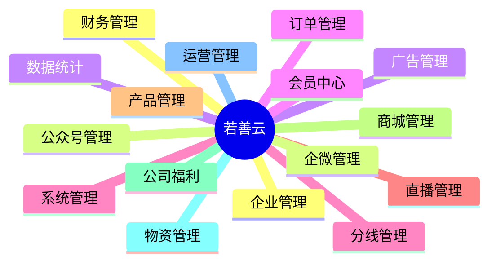

# 若善云平台介绍

不到 **5分钟为您介绍若善云平台**。

欢迎使用 **若善云平台**  一个集企业运营、内容管理、营销推广与数据统计于一体的综合性数字化管理系统。本平台致力于为企业提供高效、安全、智能的后台支持服务，助力企业实现精细化运营和业务增长。

## 一、登录方式说明

*若善云系统平台登陆验证界面*

目前平台支持 **账号密码登录**，后续将逐步开放短信与扫码登录方式。

### 1. 账号密码登录

用户需在登录页输入以下信息：

- **账号**：企业员工或管理员的唯一标识（手机号）
- **密码**：长度必须在 **6 到 10 个字符之间**

:::warning

当前不支持短信登录和扫码登录，请使用账号密码登录。

:::
### 2. 拼图验证码验证

为保障账户安全，在提交账号密码后，系统将弹出 **滑块拼图验证窗口**，用户需拖动左侧拼图块至正确位置，完成图像拼接。

*拼图验证码验证界面*

:::tip

成功完成拼图后，点击“登录”按钮即可进入系统主页面。

:::
---

## 二、系统主页面布局

登录成功后，您将进入若善云平台的主操作界面。整体布局清晰，分为三个主要区域：

| 区域 | 功能说明 |
|------|--------|
| **顶部导航栏** | 显示当前用户名称、消息通知、系统设置入口等 |
| **左侧侧边栏** | 展示所有功能模块分类，支持展开/折叠，便于快速跳转 |
| **右侧主内容区** | 显示当前选中模块的具体内容与操作面板 |

## 三、侧边栏功能结构

平台根据用户角色权限动态展示功能菜单。
按业务领域划分，所有入口均位于左侧侧边栏，结构如下：

