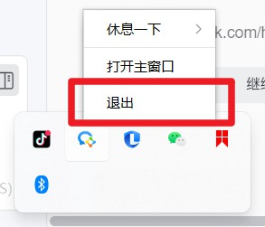
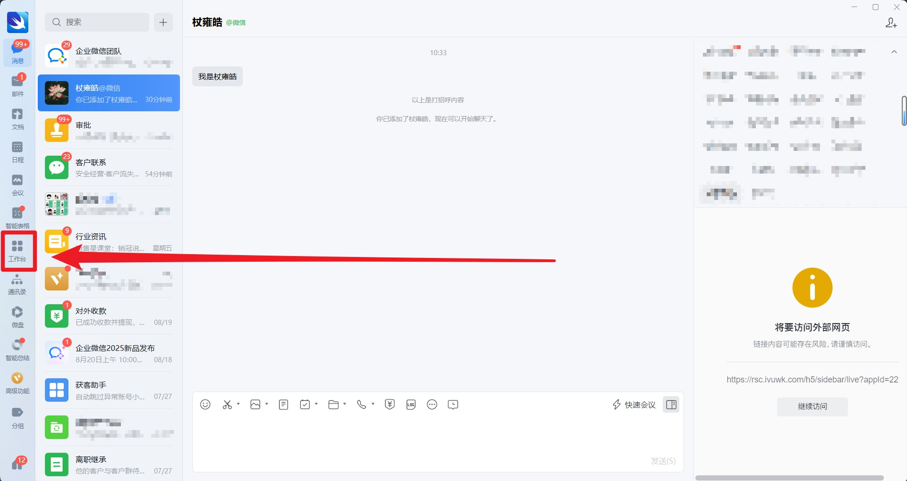
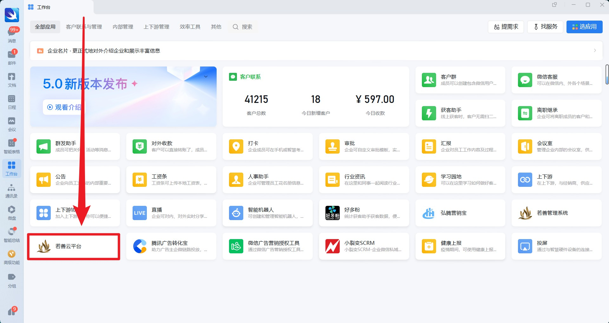
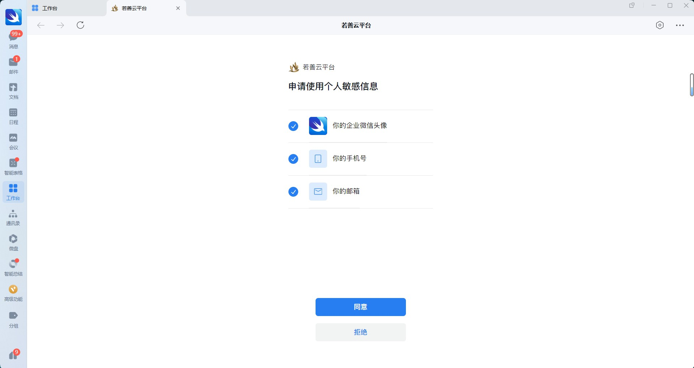
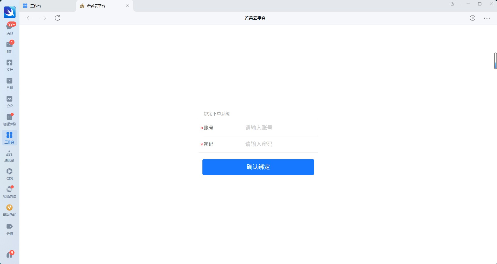
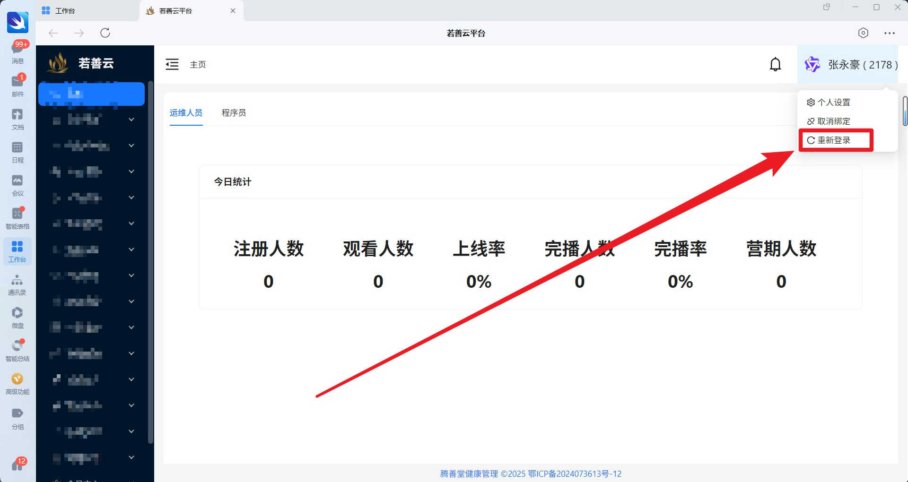
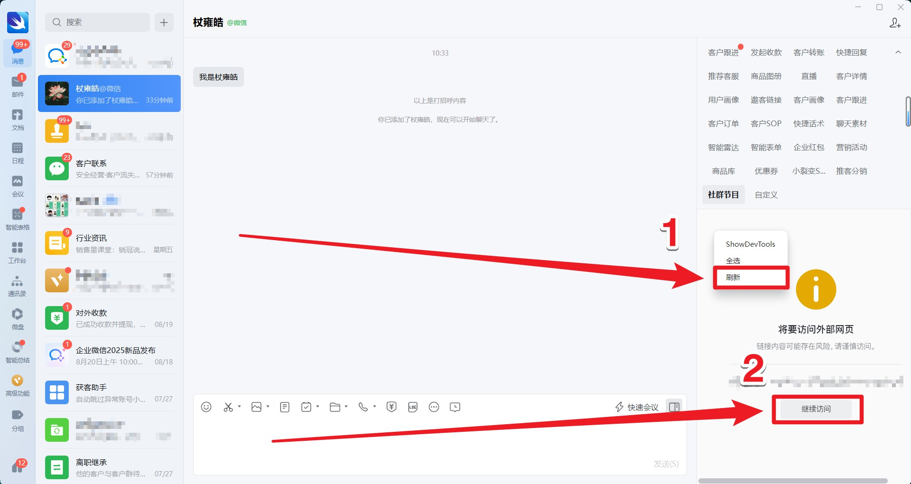
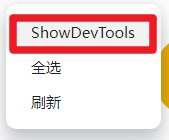
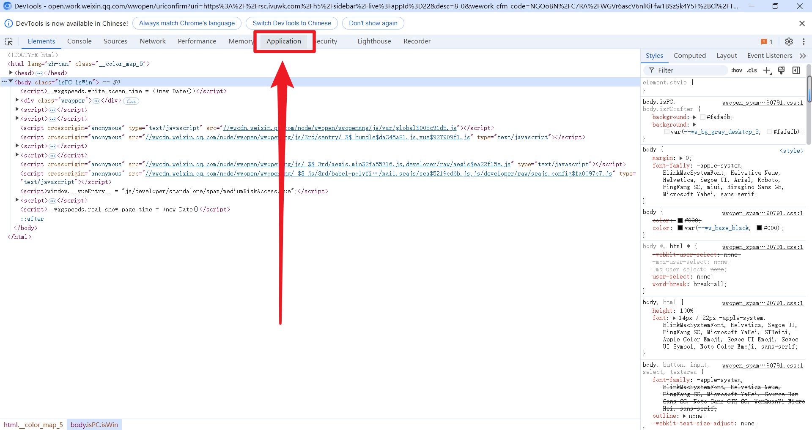
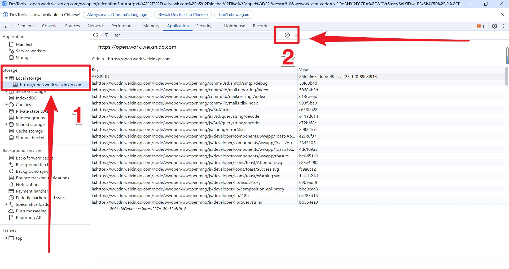

# 企业微信应用缓存刷新操作指南

当您在使用企业微信中的 **若善云系统** 应用时，如果遇到页面显示异常、数据未更新或功能失效等问题，可能是由于本地缓存导致。本文提供两种缓存刷新方法，请根据您的权限和技能选择合适的方式。

---

## 方法一：常规操作（推荐所有用户）

适用于大多数用户，无需技术背景，安全可靠。

### 1. 首先退出企业微信，然后再次打开 **企业微信客户端**

*退出企业微信*

### 2. 进入左侧导航栏的 **【工作台】**

*进入底部导航栏的 【工作台】*
### 3. 在应用列表中找到并点击 **【若善云系统】** 图标

*点击【若善云系统】*

### 4. 绑定企业微信然后输入账号密码登录【若善云系统】

*绑定企业微信*

*输入账号密码登录*

### 5. 登录成功后，系统缓存将自动刷新，如果不放心可以再次点击 重新登录

*重新登录*

### 6. 回到侧边栏，点击刷新然后再进行后续操作

*再次刷新*

✅ 完成以上步骤后，页面数据和功能应恢复正常。

:::tip

**提示**：重新登录会刷新当前会话，建议在操作前保存好正在进行的工作。

:::
---

## 方法二：高阶调试操作（仅限技术人员）

> ⚠️ **警告**：此方法涉及浏览器调试工具，操作不当可能导致数据丢失或应用异常。**不建议非专业人员操作**。

该方法通过清除 `LocalStorage` 数据强制刷新应用缓存。

### 1. 打开企业微信客户端
### 2. 进入 **【工作台】** 
### 3. 在【工作台】界面中，同时按下以下快捷键：
   

:::warning

快捷键进入调试模式 `Ctrl + Alt + Shift + D`

:::

*【调试模式已开启】*

> 📝 此操作将开启企业微信内置的 **基础调试界面**。

### 4. 鼠标**移入左侧侧边栏区域**，然后**右键单击**，选择菜单中的 **【Show DevTools】**（显示开发者工具）

*【Show DevTools】*
### 5. 在打开的开发者工具中，切换到 **Application**（应用程序）选项卡

*【Application】*
### 6. 在左侧栏展开 **Local Storage**，选择当前域名，点击右侧内容区域，按 `Ctrl + A` 全选，然后点击 **【删除】** 按钮，清空所有本地存储数据

*清理缓存*
### 7. 重新启动企业微信

*退出企业微信*

### 重要注意事项：

- 重启后，请**务必先通过【工作台】进入【若善云系统】完成登录**
- 登录成功后，再通过侧边栏或其他入口进入系统
- 若未按此顺序操作，可能导致缓存未正确重建

:::warning

清除`LocalStorage`不会删除本地保存的会话信息、用户偏好等数据。

:::
---

## 常见问题

### Q：刷新缓存后仍无法正常加载？
A：请检查网络连接，或尝试更换网络环境（如切换 Wi-Fi）。若问题持续，请联系系统管理员。

### Q：快捷键无效怎么办？
A：请确认您使用的是企业微信 **PC 客户端**，且版本为最新。旧版本可能不支持调试快捷键。

---

## 总结

| 方法 | 适用人群 | 风险等级 | 推荐指数 |
|------|----------|----------|----------|
| 方法一：重新登录 | 所有用户 | ⭐ 低 | ⭐⭐⭐⭐⭐ |
| 方法二：清除 LocalStorage | 技术人员 | ⭐⭐⭐⭐ 高 | ⭐⭐☆ |

建议优先使用 **方法一**。如问题无法解决，再由专业人员评估是否使用方法二。
