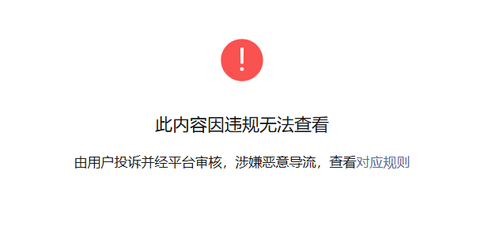

适用于内部人员处理“注册链接因违规无法查看”的问题：

:::warning

**适用对象**：若善云系统管理员、银发相关人员  

:::

---

## 一、问题描述

用户反馈注册链接提示“因违规无法查看”，导致无法正常完成注册。该问题通常由于微信公众号对历史发布的注册链接进行安全检测并判定为异常所致。需重新生成合规的注册链接以恢复访问。

*违规无法查看示例图*

---

## 二、处理目标

- 定位问题链接所属责任人  
- 取消原违规注册链接  
- 重新授权登录责任人账号  
- 在若善云系统中重新生成新的注册链接  
- 确保新链接可正常访问

---

## 三、操作步骤

### ✅ 第一步：确认问题链接所属人

1. 收到用户反馈后，首先确认是**哪位员工**发布的注册链接出现问题。
2. 获取以下信息：
   - 姓名
   - 所属部门
   - 原始发布渠道

---

### ✅ 第二步：登录若善云系统（管理员账号）

1. 打开浏览器，访问若善云系统官网并使用**管理员账号**登录。
2. 进入主界面后，点击左侧菜单栏【直播管理】。

---

### ✅ 第三步：查找问题链接（公众号文章）

1. 在【直播管理】页面，选择【公众号文章】功能模块。
2. 点击进入【公众号文章】列表页。
3. 使用搜索框，输入第一步确认的**所属人姓名**或**文章标题关键词**，查找对应的文章记录。

---

### ✅ 第四步：取消原注册链接

1. 找到目标文章后，查看其“链接类型”列，确认为“注册链接”。
2. 点击该条目右侧的【取消】按钮。
3. 系统将提示“是否确认取消该注册链接？” → 点击【确定】。
4. 原链接将被注销，不再生效。

:::danger

注意：取消后旧链接立即失效，请勿再对外传播。

:::

---

### ✅ 第五步：进入企业管理，授权登录责任人账号

1. 返回若善云主菜单，点击【企业管理】。
2. 选择【员工管理】子菜单。
3. 在搜索框中输入第一步确认的**责任人姓名**（如“张三”），查找该员工信息。
4. 找到该员工后，点击操作栏中的【授权登录】按钮。
5. 系统将跳转至该员工个人账号界面（无需密码）。

---

### ✅ 第六步：重新生成注册链接

1. 进入责任人账号后，点击左侧菜单【直播管理】→【活动档期】。
2. 找到对应活动（可通过活动名称、时间筛选），点击进入详情页。
3. 找到状态为“注册”的活动条目，勾选左侧复选框选中该活动。
4. 点击页面右上角的【公众号注册】按钮。
5. 系统将自动生成新的注册链接。

---

### ✅ 第七步：验证并交付新链接

1. 复制新生成的注册链接，在微信环境中打开测试，确认：
   - 页面可正常加载
   - 无“因违规无法查看”提示
   - 注册功能正常
2. 新链接同步提供给责任人，用于更新分享注册发布。

---

## 四、注意事项

| 项目 | 说明 |
|------|------|
| 🔐 权限要求 | 必须使用**管理员账号**执行前半部分操作 |
| 🕒 处理时效 | 建议在收到反馈后 **1小时内完成处理** |
| 📢 沟通建议 | 处理完成后通知责任人，并提醒其后续避免频繁更换链接 |
| 🔄 链接更新 | 若原文章已发布，建议通过“修改文章”功能替换链接，或发布更正声明 |

---

## 五、附录：常见问题解答（FAQ）

**Q1：为什么注册链接会被判为违规？**  
A：微信平台会动态检测链接行为，如短时间内大量访问、跳转异常、历史投诉等，可能触发安全机制。

**Q2：能否不取消直接恢复原链接？**  
A：不能。一旦被微信封禁，原链接永久失效，必须重新生成。

**Q3：是否每次都要管理员操作？**  
A：是的，目前仅管理员有权限取消链接和授权登录，建议建立标准响应流程。

---

## 六、技术支持

如有系统操作异常，请通过部门负责人联系系统运维人员。

---
