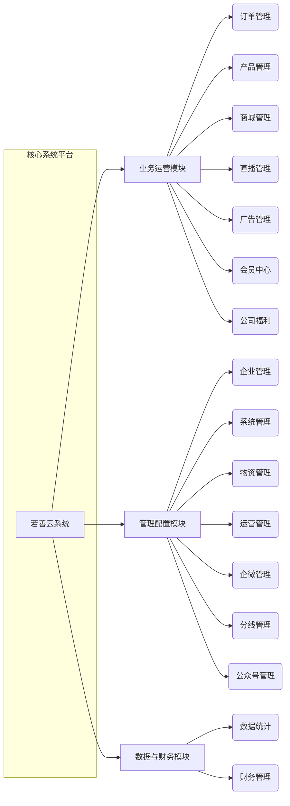

# 📘 若善云系统教程专题

:::tip

**欢迎来到“若善云系统”官方教程中心！**

:::

我们很高兴地宣布，本知识库将正式推出 **“若善云系统教程”** 专题系列。  
无论您是初次接触系统的新手，还是希望深入掌握高级功能的管理员，这里都将为您提供**全面、清晰、实用的操作指南**，助您轻松驾驭系统，提升工作效率。

---

## 🎯 专题内容概览

我们将围绕系统的核心模块，从**基础操作到进阶管理**，层层递进地为您讲解关键功能。

### 🔰 系统入门

- **系统总览**：了解若善云的整体架构与核心价值。
- **基础操作**：登录、导航、权限设置等必备技能。
- **常见问题 (FAQ)**：快速解决使用中的典型问题。

### ⚙️ 核心模块详解

:::info

**提示**：每个模块都将配有图文教程、操作视频（如支持）和最佳实践案例。

:::

